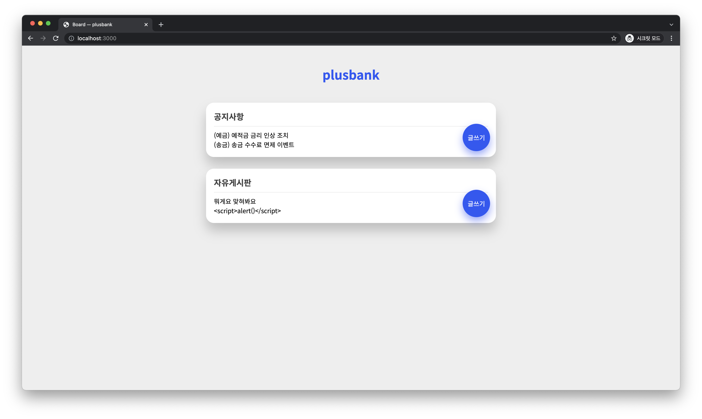

# CSRF Exercise

It is CSRF exercise page used for "[POSTECH](https://postech.ac.kr) Hacking Camp".

## Objective

Students should post messages on notice boards that are accessible only to administrators. Using CSRF, students can make admin browser upload posts.  
